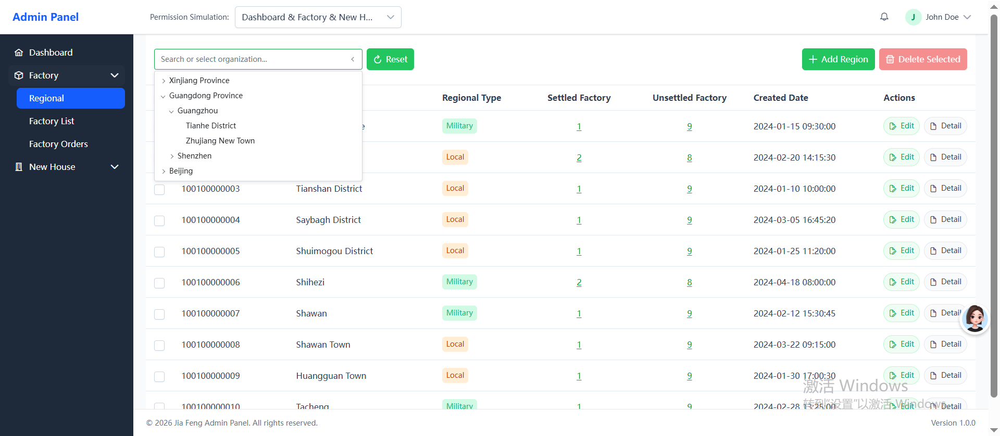
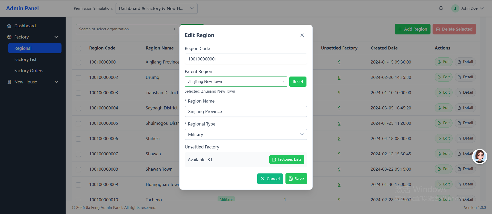
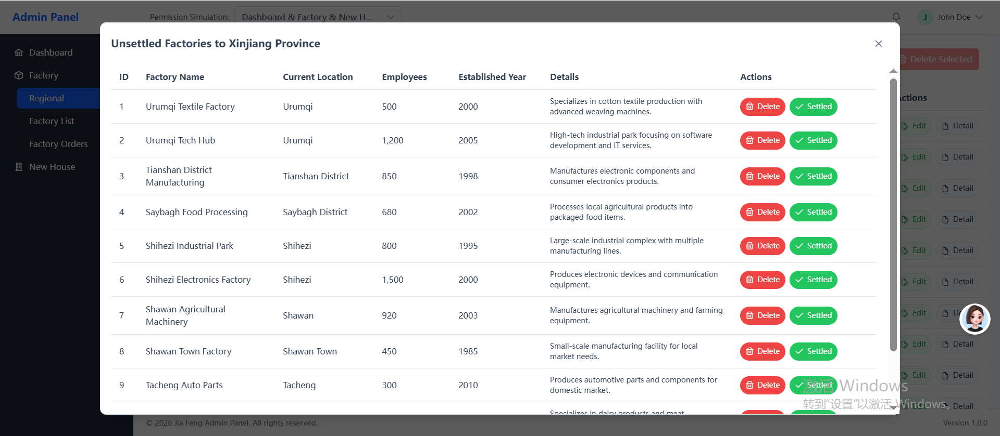

# Factory Management Platform

A **from-scratch** Angular admin platform for factory and real estate resource management, built with modern frontend technologies.

## 📋 Project Overview

This is a production-ready factory management system built **entirely from zero**. It provides comprehensive factory operations management, including factory list, orders, regional management, and real estate resource management modules.

## Project Preview






## 🛠️ Tech Stack

| Category | Technology | Version |
|----------|------------|---------|
| Framework | Angular | ^21.0.0 |
| UI | PrimeNG | ^21.1.9 |
| CSS | Tailwind CSS | ^4.3.1 |
| Language | TypeScript | ~5.9.2 |
| State Management | RxJS | ~7.8.0 |
| Testing | Vitest | ^4.0.8 |

## 🚀 Quick Start

### Prerequisites
- Node.js >= 20.x
- npm >= 11.x

### Installation
```bash
# Install dependencies
npm install

# Start development server
npm start

# Build for production
npm run build

# Run tests
npm test
```

## 📁 Project Structure

```
src/app/
├── components/              # Reusable shared components
│   ├── base-dialog/         # Base dialog wrapper
│   ├── common-tree/         # Tree component
│   └── tree-node/           # Tree node component
├── core/                    # Core infrastructure
│   ├── config/              # App configuration
│   ├── guards/              # AuthGuard
│   ├── interceptors/        # HTTP interceptor (JWT)
│   ├── services/            # AuthService, ApiService
│   └── store/               # AppStore (global state)
├── layouts/                 # Layout components
│   ├── header/              # Navigation header
│   ├── sidebar/             # Collapsible menu
│   ├── main-content/        # Content wrapper
│   ├── footer/              # Footer section
│   └── layout/              # Main layout container
├── modules/                 # Feature modules
│   ├── factory/             # Factory management module
│   │   ├── data/            # API + mock implementations
│   │   ├── models/          # TypeScript interfaces
│   │   ├── pages/           # Page components
│   │   ├── store/           # FactoryStore (state management)
│   │   ├── utils/           # Module utilities
│   │   └── factory.routes.ts
│   └── newhouse/            # Real estate management module
│       ├── data/            # API + mock implementations
│       ├── models/          # TypeScript interfaces
│       ├── pages/           # Page components
│       ├── store/           # NewhouseStore (state management)
│       ├── utils/           # Module utilities
│       └── newhouse.routes.ts
├── pages/                   # Standalone pages
│   ├── dashboard/           # Dashboard homepage
│   └── login/               # Login page
├── services/                # Common services
│   ├── menu.service.ts      # Menu navigation service
│   └── dashboard.service.ts # Dashboard data service
├── styles/                  # Global styles
├── utils/                   # Utility functions
│   ├── date-utils.ts        # Date formatting
│   ├── validation-utils.ts  # Regex validation
│   ├── form-utils.ts        # Form utilities
│   └── tree-utils.ts        # Tree helpers
├── app.config.ts            # Angular configuration
├── app.routes.ts            # Route configuration
└── app.ts                   # Application entry
```

## 📧 Contact

For professional inquiries or collaboration:
- Email: wuc939727@gmail.com

---

Built with Angular 21 + PrimeNG + Tailwind CSS