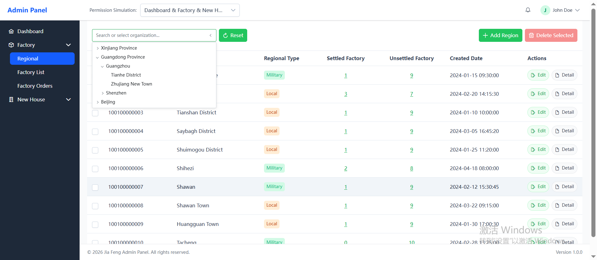
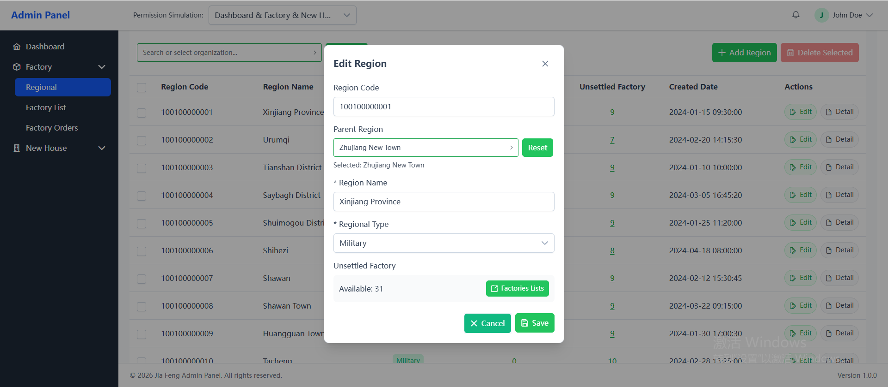
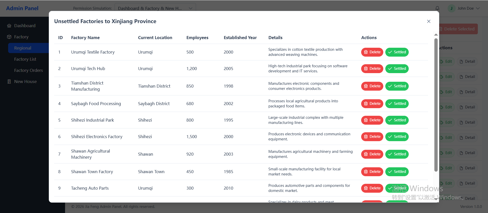

# Angular 21 Admin Template

A modern Angular admin template built with PrimeNG and Tailwind CSS, featuring modular state management and reactive programming.





## Technologies & Versions

| Technology | Version | Description |
|------------|---------|-------------|
| Angular | ^21.0.0 | Frontend framework |
| PrimeNG | ^21.1.9 | UI component library |
| PrimeIcons | ^7.0.0 | Icon library |
| Tailwind CSS | ^4.3.1 | CSS framework |
| TypeScript | ~5.9.2 | Type-safe JavaScript |
| RxJS | ~7.8.0 | Reactive programming & state management |
| Vitest | ^4.0.8 | Testing framework |

## Core Features

### State Management
- **RxJS BehaviorSubject** - Used for reactive state management across modules
- **Modular Store Pattern** - Each module has its own state management:
  - `FactoryStore` - Factory module state
  - `NewhouseStore` - Newhouse module state
- **Global AppStore** - Cross-module shared state management (`src/app/core/store/app.store.ts`)
  - Shared dictionaries (dropdown options)
  - Global notifications
  - Cross-module filters

### Security
- **Auth Guard** - Route protection for authenticated routes
- **HTTP Interceptor** - Request/response interception for authentication tokens

### Layout Components
- **Header** - Navigation header with user info
- **Sidebar** - Collapsible navigation menu
- **Main Content** - Page content area
- **Footer** - Footer section

### Reactive Programming
RxJS is extensively used throughout the project for:
- State management with `BehaviorSubject`
- Observable data streams
- Async operations handling
- Component communication

## Icons

This project uses **PrimeIcons** for icons. You can view the complete icon set at:
- [PrimeIcons Documentation](https://primeng.org/icons)

## Project Structure

```
src/app/
├── components/              # Shared components
│   ├── base-dialog/         # Base dialog component
│   ├── common-tree/         # Common tree component
│   └── tree-node/           # Tree node component
├── core/                    # Core services & config
│   ├── config/              # App configuration
│   ├── guards/              # Route guards (Auth Guard)
│   ├── interceptors/        # HTTP interceptors
│   ├── services/            # Global services (AuthService, ApiService)
│   └── store/               # Global state management (AppStore)
├── layouts/                 # Layout components
│   ├── header/              # Top navigation
│   ├── sidebar/             # Sidebar menu
│   ├── main-content/        # Main content area
│   ├── footer/              # Footer
│   └── layout/              # Layout container
├── modules/                 # Business modules
│   ├── factory/             # Factory management module
│   │   ├── data/            # Data layer (API + Mock)
│   │   ├── models/          # Data models
│   │   ├── pages/           # Page components
│   │   │   ├── factory-list/    # Factory list
│   │   │   ├── factory-orders/  # Factory orders
│   │   │   └── regional/        # Regional management
│   │   ├── store/           # Module state management (FactoryStore)
│   │   └── factory.routes.ts    # Module routes
│   └── newhouse/            # New house management module
│       ├── data/            # Data layer
│       ├── models/          # Data models
│       ├── pages/           # Page components
│       │   ├── property-developers/  # Property developers
│       │   ├── real-estate/         # Real estate management
│       │   ├── housing-resource/    # Housing resources
│       │   ├── regional/            # Regional management
│       │   └── unoccupied/          # Unoccupied management
│       ├── store/           # Module state management (NewhouseStore)
│       └── newhouse.routes.ts       # Module routes
├── pages/                   # Standalone pages
│   ├── dashboard/           # Dashboard homepage
│   └── login/               # Login page
├── services/                # Common services
│   ├── menu.service/        # Menu service
│   └── dashboard.service/   # Dashboard service
├── styles/                  # Global styles
├── utils/                   # Utility functions
│   ├── tree-utils.ts        # Tree utility functions
│   └── form-utils.ts        # Form utility functions
├── app.config.ts            # App configuration
├── app.routes.ts            # Main route config
└── app.ts                   # App entry point
```

### Directory Responsibilities

| Directory | Description |
|-----------|-------------|
| `components/` | Reusable shared components |
| `core/` | Core infrastructure (guards, interceptors, global services) |
| `layouts/` | Page layout components |
| `modules/` | Business modules (with independent state management and routes) |
| `pages/` | Standalone pages (dashboard, login, etc.) |
| `services/` | Common business services |
| `utils/` | Utility functions |

## Environment Requirements

- **Node.js**: >= 20.x (Recommended: latest LTS version)
- **npm**: >= 11.x

## Installation

```bash
# Install dependencies
npm install
```

## Development

```bash
# Start development server
npm start
```

The application will run at `http://localhost:4200/`

## Build

```bash
# Build for production
npm run build

# Build with watch mode (development)
npm run watch
```

## Testing

```bash
# Run unit tests
npm test
```

## Author

If you encounter any issues or have questions, feel free to contact me for discussion and resolution:

- **Email**: wuc939727@gmail.com

---

*Built with Angular 21 + PrimeNG + Tailwind CSS*